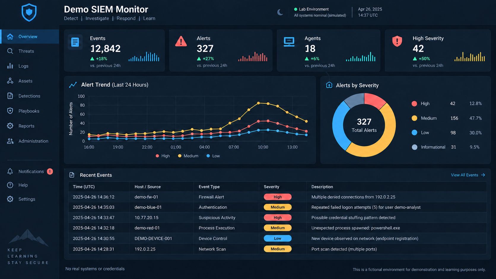

# Illustrative Reference Architecture

> **Evidence status:** Reconstructed design. It does not represent a deployed environment, measured traffic, or a live monitoring platform.

This architecture shows how an authorized security lab could separate administrative, defensive, exercise, logging, and test functions while keeping public documentation free of infrastructure identifiers.

## Trust Zones

| Generic label | Purpose | Intended boundary |
|---|---|---|
| `VLAN-MGMT` | Restricted administration | May initiate only approved management connections |
| `VLAN-BLUE` | Defensive tools and analyst activity | Sends approved telemetry and receives restricted administration |
| `VLAN-RED` | Authorized offensive-security exercises | May reach only explicitly scoped test services |
| `VLAN-LOGS` | Centralized logging and monitoring | Receives approved telemetry without broad lateral access |
| `VLAN-GUEST` | Isolated exercise targets | Receives only temporary, documented exercise traffic |

No VLAN numbers, network ranges, host addresses, account values, or device identifiers are published.

## System Roles

- A segmentation gateway that enforces cross-zone policy
- A restricted administrative workstation
- A defensive-analysis workstation
- An authorized exercise workstation
- A centralized monitoring service
- One or more isolated test workloads

Real hostnames, account names, credentials, hardware identifiers, and inventory records belong in private documentation only.

## Policy Intent

| Source | Destination | Service class | Intended action | Evidence required for validation |
|---|---|---|---|---|
| `VLAN-MGMT` | `VLAN-BLUE` | Approved administration | Allow | Transport result and matching allow event |
| `VLAN-BLUE` | `VLAN-LOGS` | Security telemetry | Allow | Listener result and ingestion evidence |
| `VLAN-RED` | `VLAN-MGMT` | Administrative access | Deny | Failed connection plus matching gateway deny event |
| `VLAN-RED` | `VLAN-GUEST` | Scoped exercise service | Temporary allow | Approved change, transport result, and expiration check |
| `VLAN-GUEST` | `VLAN-MGMT` | Unapproved service | Deny and log | Failed connection plus matching gateway deny event |
| Any zone | Unapproved destination | Any | Deny and log | Policy lookup and sanitized event reference |

A failed connection by itself does not prove that a firewall rule caused the denial; enforcement-device evidence is required.

## Validation Plan

| Check | Source zone | Expected result | Public status |
|---|---|---|---|
| Approved management path | `VLAN-MGMT` | Allow | Not run |
| Telemetry path | `VLAN-BLUE` | Allow | Not run |
| Exercise-to-management boundary | `VLAN-RED` | Deny | Not run |
| Temporary exercise path | `VLAN-RED` | Allow only during approved window | Not run |
| Guest-to-management boundary | `VLAN-GUEST` | Deny | Not run |

The operator supplies authorized targets at run time. This repository deliberately does not provide executable addresses.

## Illustrative Dashboard

The image is a portfolio mockup that demonstrates a reporting layout. It is not evidence from Wazuh or another running monitoring platform.

## Evidence Promotion Rule

A check may change from `Not run` only after an authorized test records the platform version, declared source zone, bounded procedure, expected outcome, sanitized observed outcome, corresponding gateway or monitoring event, and limitations. Original evidence should remain private.

## Related Material

- [Segmentation validation case study](../network-segmentation/testing-results.md)
- [Wazuh investigation case study](../wazuh-siem/monitoring-notes.md)
- [Reusable technical artifacts](../artifacts/README.md)
